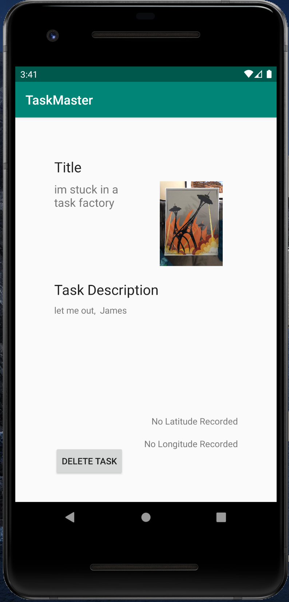

# TaskMaster
### Author: James Dansie

This app is for making todo lists on Android. 

### Installation
Clone the repo, then open with android studio.

### Home Page
This is little out of date. Background color has been updated.

### Add Task Page

### All Tasks Page

### Detail View

### Settings

### Changelog
2019/10/22
Built out the home page, add task, and all tasks  

2019/10/23
Built out the detail view, and settings page. Added shared preferences to find the user name.

2019/10/24
Added Recycle view and event listener to the homepage.

2019/10/29
Added a web server.

2019/10/30
Added dynamoDB to store tasks in the cloud.

2019/10/31
Added teams to dynamoDB. Front page filters based off of the team in settings.

2019/11/05
Added Auth log in. Front page displays the user name, and changes on log out.